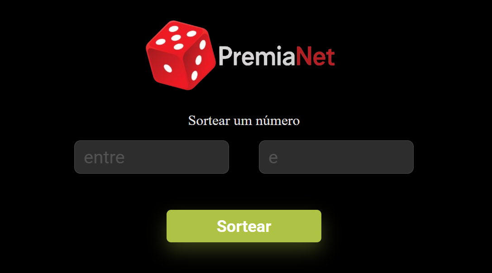

# PremiaNet

<p align="center">
  
</p>

PremiaNet é um site desenvolvido para oferecer uma experiência de navegação rápida e moderna, utilizando HTML, CSS e JavaScript. O objetivo é proporcionar uma interface amigável para os usuários, com foco em design e usabilidade.


## 🚀 Demonstração
Acesse o projeto online: [PremiaNet](https://alessandroveras97.github.io/PremiaNet/)

## 🛠️ Tecnologias usadas
- HTML
- CSS
- JavaScript

## 📸 Imagem do projeto


## 💻 Como rodar o projeto

1. Clone o repositório:
   ```bash
   git clone https://github.com/alessandroveras97/PremiaNet.git
